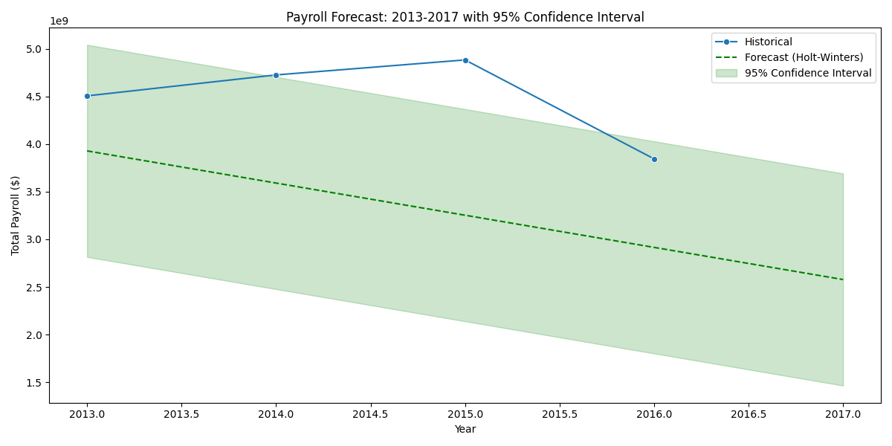

# LA City Payroll Analysis 📊

This project uses Python to analyze the **Los Angeles City Payroll** dataset, generating insights into public employee compensation, trends over time, and department-specific patterns using statistical forecasting and data visualization.

---

## 📚 About the Dataset

📎 **Source:** [Kaggle - City of LA Payroll Data](https://www.kaggle.com/datasets/cityofLA/city-payroll-data/data)

🗂️ **Description:**  
The Los Angeles City Controller’s Office releases detailed payroll records for city employees on a quarterly basis. This dataset includes:

- Department and job titles  
- Projected annual salary  
- Quarterly and total pay  
- Bonuses and benefits

🕒 **Time Range:**  
Data available from **2013 to present**, updated quarterly.

---

## 🔧 Features

- 📌 **Pay vs. Years of Service** — Scatterplots showing compensation over time by department
- 📊 **Department Analysis** — Focus on specific departments like LAPD
- 🔮 **Payroll Forecasting** — Uses Holt-Winters (triple exponential smoothing) to forecast future payroll expenses
- 📈 **Median Pay Trends** — Tracks median salary per job title over the years

---

## 📁 Project Structure
📁 data/ ← CSV format from Kaggle
📁 notebooks/ ← Python analysis scripts
📁 Outputs/
└── 📁 Figures/ ← Generated plots (.png)
README.md ← This file

---

## 🖥️ Example Output

A few figures you'll get after running the analysis:

- `pay_vs_service_scatter.png`  
- `pay_distribution_boxplot.png`  
- `payroll_forecast_ci.png`  
- `median_pay_by_job_title.png`

---
